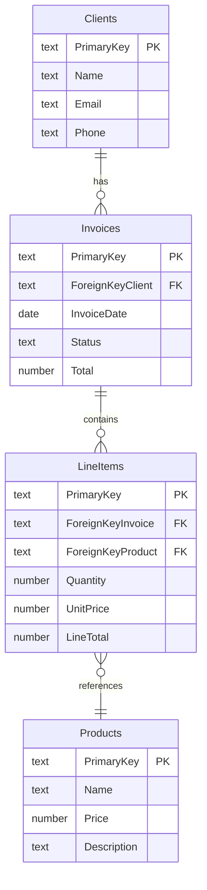

# Schema Plan

Design a complete data model for a new FileMaker solution. Takes a natural language application description (and optionally existing SQL DDL, spreadsheet structure, or legacy schema) and produces two artifacts:

1. **Mermaid ERD** — base tables, their fields, and relationships
2. **FM-specific model** — extends the ERD with table occurrences (TOs) and a relationship specification

**Output files:**
- `plans/schema/{solution-name}-erd.md` — Mermaid ERD (base tables only)
- `plans/schema/{solution-name}-fm-model.md` — FM-specific model with TOs and relationship specs

---

## FileMaker data model concepts

The agent must understand these distinctions when designing a schema. See also `agent/docs/knowledge/disambiguation.md` for the full table-vs-TO disambiguation.

### Base tables vs table occurrences

- **Base tables** are the physical storage containers — they hold the actual data. These map to ERD entities.
- **Table occurrences (TOs)** are named pointers to base tables that live in the relationship graph. A base table can have multiple TOs pointing to it.
- When a base table is created, FileMaker auto-creates one TO with the same name. This is the **primary TO**.
- Additional TOs are created manually by the developer to support different relationship paths, filtered portals, or alternate join conditions.
- **Every layout is based on a TO** (not a base table). The TO determines which relationship paths are available from that layout.
- Common TO naming: `BaseTableName` for the primary TO, `BaseTableName_purpose` for utility TOs (e.g., `Invoices_by_Client`, `Invoices_by_Staff`).

### Relationships

- Relationships connect **two TOs** (not base tables) via one or more join field pairs.
- Each relationship specifies: left TO, right TO, join fields, join operator (usually `=`), cascade delete, and allow creation of related records.
- Relationships are **always manual** in FileMaker Pro — they cannot be created via any API (OData, Data API, or otherwise). The skill produces a specification, not executable code.

### TOs and the API boundary

- TOs cannot be created via API either — only the auto-created one per base table exists until the developer manually adds more in the relationship graph.
- The skill should identify which TOs will be needed beyond the auto-created ones, and explain why each is necessary.

---

## FM-specific field conventions

Every base table gets these system fields automatically when created (whether manually or via OData):

| Field | Type | Auto-enter | Purpose |
|-------|------|------------|---------|
| `PrimaryKey` | Text | Get ( UUID ) on creation | Unique record identifier |
| `CreationTimestamp` | Timestamp | Creation timestamp | When the record was created |
| `CreatedBy` | Text | Creation account name | Who created the record |
| `ModificationTimestamp` | Timestamp | Modification timestamp | When the record was last modified |
| `ModifiedBy` | Text | Modification account name | Who last modified the record |

These do not need to be listed in the ERD unless the developer requests full field detail. They are assumed present in every table.

**Foreign key naming**: `ForeignKey{RelatedTableName}` (e.g., `ForeignKeyClient`, `ForeignKeyInvoice`). Always Text type to match the UUID primary key.

**FM field types**: Text, Number, Date, Time, Timestamp, Container. There is no Boolean type — use Number (1/0) or Text ("Yes"/"No") depending on convention.

---

## Workflow

### Step 1 — Understand the requirements

Read the developer's application description carefully. If they provided existing schema (SQL DDL, spreadsheet headers, legacy structure), parse it for entities and relationships.

Identify:
- **Core entities** — the main business objects (Clients, Products, Orders, etc.)
- **Relationships** — how entities connect (one-to-many, many-to-many)
- **Key attributes** — important fields beyond system fields
- **Business rules** — constraints that affect the data model (e.g., "an order must belong to a client", "products can be in multiple categories")

If the description is ambiguous or incomplete, ask clarifying questions before proceeding. Common questions:
- "Does a [thing] belong to exactly one [other thing], or can it belong to many?"
- "Do you need to track [attribute] — that would suggest a separate table rather than a field"
- "Is [entity] a lookup/reference table (rarely changes) or a transactional table (records created frequently)?"

### Step 2 — Design the base tables

For each identified entity, define:
- **Table name** — singular or plural per the developer's preference (ask if unclear; FM convention varies)
- **Fields** — beyond the system fields, list each field with its FM type
- **Purpose** — one-line description of what the table stores

Handle many-to-many relationships by introducing a **join table** (e.g., `ProductCategories` to connect `Products` and `Categories`).

### Step 3 — Present the Mermaid ERD

Generate a Mermaid `erDiagram` showing all base tables, their fields, and relationships.

#### Mermaid syntax reference



**Cardinality notation:**

| Pattern | Mermaid | Meaning |
|---------|---------|---------|
| One-to-many | `\|\|--o{` | One parent, many children |
| Many-to-one | `}o--\|\|` | Many children, one parent |
| One-to-one | `\|\|--\|\|` | One-to-one |
| Many-to-many | `}o--o{` | Many-to-many (use join table instead) |

**Field conventions in the ERD:**
- Use FM field types as the type label: `text`, `number`, `date`, `timestamp`, `time`, `container`
- Annotate primary keys with `PK` and foreign keys with `FK`
- Omit system fields (CreationTimestamp, CreatedBy, ModificationTimestamp, ModifiedBy) — they are assumed present
- Include PrimaryKey and all ForeignKey fields explicitly

### Step 4 — Review ERD with the developer

Present the ERD and ask the developer to confirm:

> Review the ERD above. Does this capture the right entities and relationships? Reply with any changes (e.g., "add a Notes table", "Staff should connect to Invoices", "remove the Categories table") or confirm with "looks good" to proceed to the FM-specific model.

Iterate until the developer approves the ERD.

### Step 5 — Extend to FM-specific model

Once the ERD is confirmed, produce the FM-specific model that extends it with:

#### 5a — Table occurrences

List all TOs that will be needed. Start with the auto-created primary TOs (one per base table, same name), then identify additional TOs required for:

- **Portal relationships** — showing related records from a different context (e.g., `Invoices_by_Client` to show a client's invoices on a Client layout)
- **Filtered views** — a TO with a different join condition to show a subset of records (e.g., `Invoices_Open` joined on Status = "Open")
- **Self-joins** — when a table relates to itself (e.g., `Staff_Manager` for a manager-employee hierarchy)
- **Multi-path relationships** — when the same two base tables need to connect through different field pairs

Format:

```
## Table Occurrences

### Auto-created (one per base table)
These are created automatically when the base table is created.

| TO Name | Base Table |
|---------|------------|
| Clients | Clients |
| Invoices | Invoices |
| LineItems | LineItems |
| Products | Products |

### Additional TOs (manual creation required)
These must be created manually in the relationship graph.

| TO Name | Base Table | Purpose |
|---------|------------|---------|
| Invoices_by_Client | Invoices | Show client's invoices in a portal on the Clients layout |
| LineItems_by_Invoice | LineItems | Show line items in a portal on the Invoices layout |
```

#### 5b — Relationship specification

Produce a click-through checklist the developer can follow to create each relationship manually in the relationship graph. This is the primary deliverable of the FM-specific model.

Format each relationship as:

```
## Relationships

### 1. Clients -> Invoices (one-to-many)
- **Left TO**: Clients
- **Right TO**: Invoices
- **Join**: Clients::PrimaryKey = Invoices::ForeignKeyClient
- **Cascade delete**: Off
- **Allow creation**: Off

### 2. Invoices -> LineItems (one-to-many)
- **Left TO**: Invoices
- **Right TO**: LineItems
- **Join**: Invoices::PrimaryKey = LineItems::ForeignKeyInvoice
- **Cascade delete**: On (delete line items when invoice is deleted)
- **Allow creation**: On (allow creating line items from invoice portal)

### 3. LineItems -> Products (many-to-one lookup)
- **Left TO**: LineItems
- **Right TO**: Products
- **Join**: LineItems::ForeignKeyProduct = Products::PrimaryKey
- **Cascade delete**: Off
- **Allow creation**: Off
```

For each relationship, provide guidance on cascade delete and allow creation:
- **Cascade delete: On** — when child records are meaningless without the parent (e.g., line items without an invoice)
- **Allow creation: On** — when the developer needs to create child records from a portal on the parent layout
- Default both to **Off** unless there is a clear reason to enable them

#### 5c — Layout suggestions

Briefly suggest which layouts the solution will likely need, and which TO each should be based on:

```
## Suggested Layouts

| Layout Name | Based on TO | Purpose |
|-------------|-------------|---------|
| Client List | Clients | List view of all clients |
| Client Detail | Clients | Detail view with invoices portal |
| Invoice Detail | Invoices | Detail view with line items portal |
| Product List | Products | List/selection of products |
```

### Step 6 — Write the output files

Create the `plans/schema/` directory if it does not exist.

**File 1: `plans/schema/{solution-name}-erd.md`**

```markdown
# {Solution Name} — Entity Relationship Diagram

Designed: {date}

## Tables

{brief description of each table's purpose}

## ERD

{mermaid diagram}
```

**File 2: `plans/schema/{solution-name}-fm-model.md`**

```markdown
# {Solution Name} — FileMaker Data Model

Designed: {date}
Based on: {solution-name}-erd.md

## System Fields (all tables)

Every table includes these auto-created fields:
- PrimaryKey (Text, auto-enter UUID)
- CreationTimestamp (Timestamp, auto-enter)
- CreatedBy (Text, auto-enter)
- ModificationTimestamp (Timestamp, auto-enter)
- ModifiedBy (Text, auto-enter)

## Field Definitions

{complete field list per table, excluding system fields}

## Table Occurrences

{auto-created and additional TOs}

## Relationships

{click-through relationship specification}

## Suggested Layouts

{layout suggestions}

## Next Steps

1. Create the base tables (via OData with `schema-build` or manually in FM Pro)
2. Create additional table occurrences in the relationship graph
3. Create relationships per the specification above
4. Create layouts based on the suggested TO assignments
```

### Step 7 — Report to the developer

Confirm both files were written and summarize:
- Number of base tables
- Number of relationships
- Number of additional TOs beyond the auto-created ones
- Suggest running `schema-build` next to create the tables and fields in a live solution

---

## Key considerations

- **No Boolean type in FM** — use Number (1 = true, 0 = false) for boolean fields. Name them descriptively (e.g., `IsActive`, `HasShipped`).
- **No auto-increment in FM** — primary keys use UUID (Get ( UUID )) not sequential integers. This is critical for multi-user and sync scenarios.
- **Foreign keys are always Text** — they store UUIDs, not integer IDs.
- **Calculation fields** — if a field's value is always derived from other fields (e.g., `LineTotal = Quantity * UnitPrice`), note it as a calculated field in the field definitions. Specify whether it should be a stored calculation (auto-enter calc that replaces existing value) or an unstored calculation (recalculated on access).
- **Summary fields** — if a field aggregates across a found set (e.g., `InvoiceTotal = Sum of LineItems::LineTotal`), note it as a summary field.
- **Container fields** — for storing files, images, or documents. Note whether the container should use external storage.
- **Global fields** — for UI state, preferences, or temporary values. These are session-scoped on hosted files.

## Examples

### Example 1 — Simple invoicing app

Developer: "I need an invoicing app. Clients have invoices, invoices have line items, line items reference products."

1. Identify 4 entities: Clients, Invoices, LineItems, Products
2. Design fields for each (Name, Email for Clients; InvoiceDate, Status, Total for Invoices; etc.)
3. Generate ERD with 3 one-to-many relationships
4. Developer confirms
5. FM model adds TOs for portals (Invoices_by_Client, LineItems_by_Invoice)
6. Relationship spec with cascade delete on Invoices->LineItems, allow creation on the portal relationships
7. Write both files to `plans/schema/invoicing-erd.md` and `plans/schema/invoicing-fm-model.md`

### Example 2 — From existing SQL DDL

Developer: "Here's my PostgreSQL schema, translate it to FileMaker" + provides CREATE TABLE statements

1. Parse SQL DDL for tables, columns, types, constraints, and foreign keys
2. Map SQL types to FM types (VARCHAR/TEXT -> Text, INTEGER/DECIMAL -> Number, DATE -> Date, etc.)
3. Replace SQL auto-increment PKs with UUID-based PrimaryKey
4. Replace SQL integer FKs with Text ForeignKey fields
5. Handle SQL ENUM types as value lists (note in the model)
6. Handle SQL JOIN tables as FM join tables
7. Present ERD for confirmation, then produce FM model

### Example 3 — From spreadsheet structure

Developer: "I have these spreadsheets: Contacts.xlsx (Name, Company, Email, Phone), Orders.xlsx (OrderDate, ContactName, Product, Qty, Price)"

1. Identify that "ContactName" in Orders is a denormalized reference to Contacts — normalize with a ForeignKeyContact field
2. Suggest separating Products into its own table if the same product appears in multiple orders
3. Present the normalized ERD for confirmation
4. Produce FM model with proper foreign key relationships
