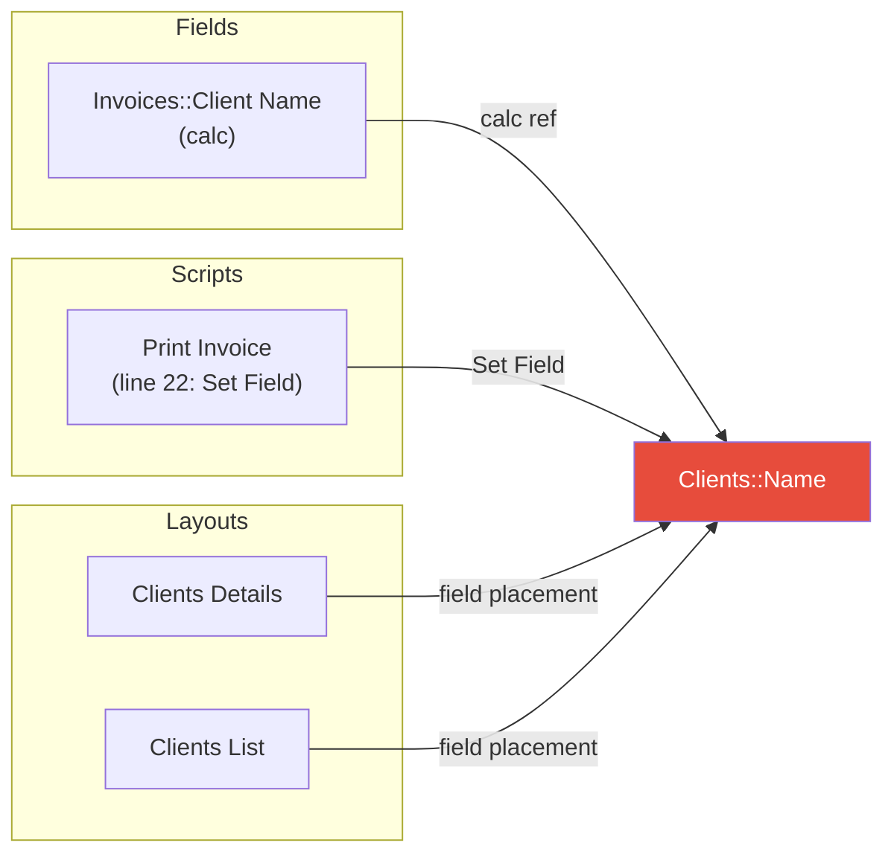
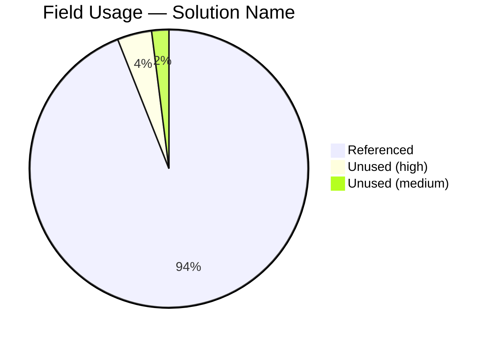

# Trace — Cross-Reference Tracer

This skill traces references to FileMaker objects (fields, scripts, custom functions, layouts, value lists) across an entire solution. It combines a **deterministic Python engine** (`agent/scripts/trace.py`) for fast, exhaustive scanning with **agentic correlation** for edge cases that require judgment.

## Architecture

### Layer 1: Deterministic engine (`trace.py`)

Scans all solution data sources and builds `agent/context/{solution}/xref.index` — a compact cross-reference index. Supports three commands:

```bash
python3 agent/scripts/trace.py build  -s "Solution Name"     # build xref.index
python3 agent/scripts/trace.py query  -s "Solution Name" -t TYPE -n "Name"  # query refs
python3 agent/scripts/trace.py dead   -s "Solution Name" -t TYPE  # find unused objects
```

Query types: `field`, `script`, `layout`, `value_list`, `custom_func`, `table_occurrence`
Dead types: `fields`, `scripts`, `custom_functions`, `layouts`, `value_lists`

The `query` and `dead` commands read from the pre-built `xref.index` file — they do not re-scan source files. This means queries are fast (single file read) and the expensive `build` step only needs to run once per schema change.

### Layer 2: Agentic correlation (this skill)

Adds judgment for things static analysis cannot handle: ExecuteSQL strings, dynamic references, ambiguity resolution, severity classification, and false positive filtering.

## Data sources scanned by trace.py

| Source | What it finds |
|--------|---------------|
| `fields.index` — auto-enter and calc columns | Field-to-field references, custom function calls in calcs |
| `scripts_sanitized/*.txt` | Field refs (Set Field, Set Variable, If, etc.), layout refs (Go to Layout), script refs (Perform Script), CF calls |
| `custom_functions_sanitized/*.txt` | TO::Field refs, CF-to-CF calls |
| `context/{solution}/layouts/*.json` | Field placements and button scripts on layouts |
| `relationships.index` | Join field references |
| `value_lists/*.xml` | Field-based value list sources |

All field references are normalized to **canonical form** (`BaseTable::FieldName`) using `table_occurrences.index` for TO resolution. The original TO is preserved in the reference context.

---

## Workflow

### Step 1 — Preflight (parallel)

Run all of these checks **in a single parallel batch** — they are independent:

```bash
# 1a. Discover solutions
ls agent/context/

# 1b. Check xref.index existence and age
stat agent/context/{solution}/xref.index

# 1c. Check layout summaries exist
ls agent/context/{solution}/layouts/ 2>/dev/null | head -1

# 1d. Check webviewer status (for later visualization offer)
curl -s http://localhost:8765/webviewer/status
```

**Solution resolution:**
- If one subfolder exists, use it automatically.
- If multiple exist, ask the developer which solution.
- If none exist, instruct the developer to run `fmcontext.sh`.

**xref.index caching — avoid unnecessary rebuilds:**
- If `xref.index` **exists** and the developer has not mentioned schema changes (new fields, renamed tables, new scripts, etc.), **use it directly** — skip the build. This is the single biggest time saver.
- If `xref.index` is **missing**, build it: `python3 agent/scripts/trace.py build -s "{solution}"`
- If the developer explicitly says the schema changed, or if trace results look wrong, **rebuild**: `python3 agent/scripts/trace.py build -s "{solution}"`

**Layout summary dependency**: If `agent/context/{solution}/layouts/` is empty or missing, warn and suggest:

```bash
python3 agent/scripts/layout_to_summary.py --solution "{solution}"
```

Then rebuild xref.index.

Save the webviewer status result for Step 5b — do not check again later.

### Step 2 — Infer mode from the developer's request

| Request pattern | Mode | Action |
|----------------|------|--------|
| "Where is X used?" / "Find references to X" / "Trace X" | **Usage** | Run `query` for the named object |
| "What breaks if I rename X?" / "Impact of changing X" | **Impact** | Run `query` for the object + agentic severity analysis |
| "Show unused fields" / "Dead code" / "Unused scripts" | **Dead** | Run `dead` for the specified type |
| "What does X reference?" / "Dependencies of X" | **Outbound** | Run `query --direction outbound` |

### Step 3 — Run deterministic query + agentic grep (parallel)

The engine query and the agentic grep passes are **independent** — run them in the same parallel batch. This is the core optimization: instead of query-then-grep sequentially, issue all calls simultaneously.

#### Usage mode — parallel batch:

Run all of these in a **single message with parallel tool calls**:

```bash
# 3a. Deterministic query
python3 agent/scripts/trace.py query -s "{solution}" -t {type} -n "{name}"

# 3b. ExecuteSQL string scan (agentic — only for field/table traces)
grep -rl "ExecuteSQL" "agent/xml_parsed/scripts_sanitized/{solution}/" --include="*.txt"

# 3c. Dynamic reference scan (agentic — only for field/script traces)
grep -rn "GetField\|GetFieldName\|Evaluate\|Perform Script by Name" "agent/xml_parsed/scripts_sanitized/{solution}/" --include="*.txt"
```

Skip 3b/3c when they are not relevant to the object type (e.g., skip ExecuteSQL scan when tracing a layout).

#### Dead mode:

```bash
python3 agent/scripts/trace.py dead -s "{solution}" -t {type}
```

Add `--verbose` to include low-confidence results (system fields, globals, summaries). No parallel agentic grep needed — false positive filtering (Step 4e) uses the dead output directly.

#### Impact mode — parallel batch:

For a table rename or broad impact analysis, run **all queries in parallel**:

```bash
# 3a. Query the primary object
python3 agent/scripts/trace.py query -s "{solution}" -t {type} -n "{name}"

# 3b. Query related objects (e.g., table as TO for table renames)
python3 agent/scripts/trace.py query -s "{solution}" -t table_occurrence -n "{table_name}"

# 3c. ExecuteSQL scan
grep -rl "ExecuteSQL" "agent/xml_parsed/scripts_sanitized/{solution}/" --include="*.txt"

# 3d. Dynamic reference scan
grep -rn "GetField\|GetFieldName\|Evaluate" "agent/xml_parsed/scripts_sanitized/{solution}/" --include="*.txt"
```

For a table rename affecting many fields, run one query per affected field — all in parallel.

#### Outbound mode:

```bash
python3 agent/scripts/trace.py query -s "{solution}" -t {type} -n "{name}" --direction outbound
```

### Step 4 — Agentic correlation (on parallel results)

Analyze the results gathered in Step 3. All grep output is already available — this step is pure analysis, no additional tool calls needed unless a specific ExecuteSQL script needs closer reading.

#### a. ExecuteSQL string analysis

From the grep results (3b), for each script containing `ExecuteSQL`:
- Read only the relevant lines (not the full script) to analyze the SQL string
- SQL uses **raw table names** (not TOs) and may differ from FM field names
- SQL strings may be built via concatenation or variables
- Map SQL table/column names to base tables/fields from `fields.index`
- Flag as "dynamic reference — may be affected" with explanation

**Batch reads**: If multiple scripts matched, read the relevant sections in parallel.

#### b. Dynamic references

From the grep results (3c), flag any script step using:
- **GetField()** / **GetFieldName()** — field names as strings or variables
- **Evaluate()** — arbitrary calculation evaluation at runtime
- **Perform Script by Name** — script name from a variable

Note the variable source so the developer can trace manually. These cannot be resolved statically.

#### c. Ambiguity resolution

When the same field name exists in multiple tables (e.g., `Status` in `Clients`, `Invoices`, and `Products`), unqualified references in calcs are ambiguous. Use layout context and TO context to disambiguate where possible.

#### d. Impact severity classification (impact mode only)

| Severity | Meaning | Examples |
|----------|---------|----------|
| **BREAK** | Direct reference that will error | Set Field, Set Variable, If condition referencing the renamed object |
| **WARN** | Indirect reference that may fail | ExecuteSQL string literal, GetField with concatenated name |
| **INFO** | FM auto-updates on rename | Layout field placements, relationship graph join fields |

#### e. False positive filtering (dead mode only)

Review dead object results and filter:
- Fields whose only auto-enter references `Self` (active even with no external refs)
- Scripts likely triggered by buttons — check layout summaries for button scripts
- Custom functions used only by other custom functions — trace the chain to see if it leads to active code
- Fields that serve as UI display only (on a layout, not in scripts) — flag as medium confidence, not truly dead

### Step 5 — Present the report

Format the combined results as a structured report appropriate to the mode:

**Usage mode**: Group by source type (field calcs, scripts, layouts, relationships, etc.) with counts.

**Impact mode**: Group by severity (BREAK, WARN, INFO) with specific locations and explanations.

**Dead mode**: Group by confidence (HIGH, MEDIUM, LOW) with counts and summary.

### Step 5b — Webviewer visualization (conditional)

Use the webviewer status captured in Step 1d (do not re-check).

If `"running": true`, prompt the developer:

> The webviewer is running. Would you like a visual diagram of these references?

If yes, generate a Mermaid diagram appropriate to the mode and push it:

#### Usage/Impact mode — Flowchart

Generate a `flowchart LR` centered on the target object, with subgraphs grouping referencing objects by type. For impact mode, color nodes by severity (red = BREAK, yellow = WARN, green = INFO).



#### Dead mode — Pie chart



#### Push to webviewer

```bash
curl -s -X POST http://localhost:8765/webviewer/push \
  -H "Content-Type: application/json" \
  -d '{"type": "diagram", "content": "<mermaid source>", "repo_path": "<project root>"}'
```

---

## xref.index format

Pipe-delimited, one line per reference:

```
# SourceType|SourceName|SourceLocation|RefType|RefName|RefContext
```

| Column | Description |
|--------|-------------|
| SourceType | `field_calc`, `field_auto`, `script`, `layout`, `custom_func`, `relationship`, `value_list` |
| SourceName | Canonical ID: `Invoices::Client Name`, `Print Invoice (ID 158)` |
| SourceLocation | Where: `calc:Clients Primary::Name`, `line 14: Set Field`, `field placement` |
| RefType | `field`, `script`, `layout`, `value_list`, `custom_func`, `table_occurrence` |
| RefName | Canonical (base table for fields): `Clients::Name` |
| RefContext | Detail: `via TO "Clients Primary"`, `same table`, `left side`, empty |

---

## Tool call budget

Target tool calls from invocation to results presented:

| Mode | Without cache | With xref.index cached |
|------|---------------|------------------------|
| Usage | 3 (preflight + build, query+grep, report) | 2 (preflight+query+grep, report) |
| Dead | 3 (preflight + build, dead, report) | 2 (preflight+dead, report) |
| Impact | 4 (preflight + build, parallel queries+grep, reads, report) | 3 (preflight+queries+grep, reads, report) |

The key savings come from: (1) skipping `build` when xref.index exists, (2) running the deterministic query and agentic grep passes in the same parallel batch, (3) batching all preflight checks together, (4) caching the webviewer status from preflight instead of checking it after analysis.

---

## Examples

### Example 1 — Usage report

Developer: "Where is `Clients::Name` used?"

1. **Parallel preflight**: `ls agent/context/`, `stat xref.index`, `curl webviewer/status` -- xref.index exists, skip build
2. **Parallel query+grep**: `trace.py query -t field -n "Clients::Name"` + `grep -rl "ExecuteSQL" scripts_sanitized/` + `grep -rn "GetField" scripts_sanitized/` -- all in one batch
3. Correlate: no ExecuteSQL hits reference Clients table, no dynamic refs
4. Present report: 2 field calcs, 7 layout placements, 0 scripts

**Tool calls: 2** (preflight batch, query+grep batch) + report presentation

### Example 2 — Dead object scan

Developer: "Show me all unused fields"

1. **Parallel preflight+dead**: `ls agent/context/`, `stat xref.index`, `trace.py dead -t fields` -- xref.index exists, run dead immediately alongside preflight
2. Verify: `Invoices::FoundCount` and `Line Items::FoundCount` are unstored calcs for `Get(FoundCount)` — used only at runtime on layouts with the field present
3. Check layouts for FoundCount fields -- if present, downgrade to medium
4. Present report with confidence levels

**Tool calls: 1-2** (preflight+dead batch, optional layout check) + report presentation

### Example 3 — Impact analysis

Developer: "What breaks if I rename the Clients table to Companies?"

1. **Parallel preflight**: confirm xref.index exists, check webviewer
2. **Parallel queries+grep** (single batch):
   - `trace.py query -t field -n "Clients::*"` for each field (or grep xref.index directly for all Clients:: refs)
   - `trace.py query -t table_occurrence -n "Clients"`
   - `grep -rl "ExecuteSQL" scripts_sanitized/`
3. Read matched ExecuteSQL scripts in parallel to check for `Clients` table references
4. Classify: Set Field/Set Variable refs = BREAK, layout placements = INFO, ExecuteSQL strings = WARN
5. Present severity-grouped report
6. Webviewer was running (from Step 1) -- offer flowchart diagram with severity coloring

**Tool calls: 3** (preflight, parallel queries+grep, parallel script reads) + report presentation
